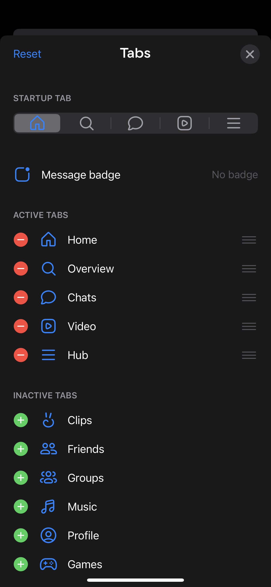
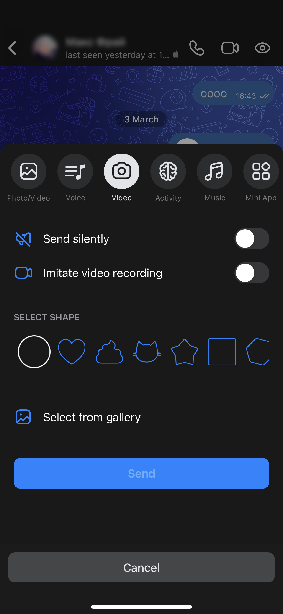
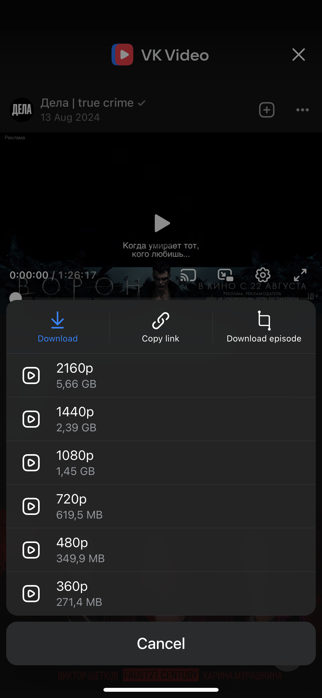
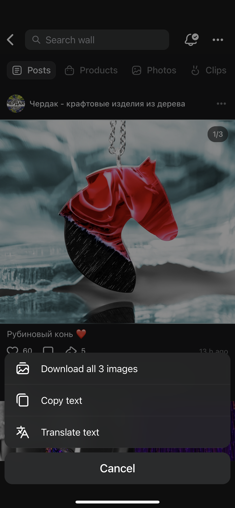
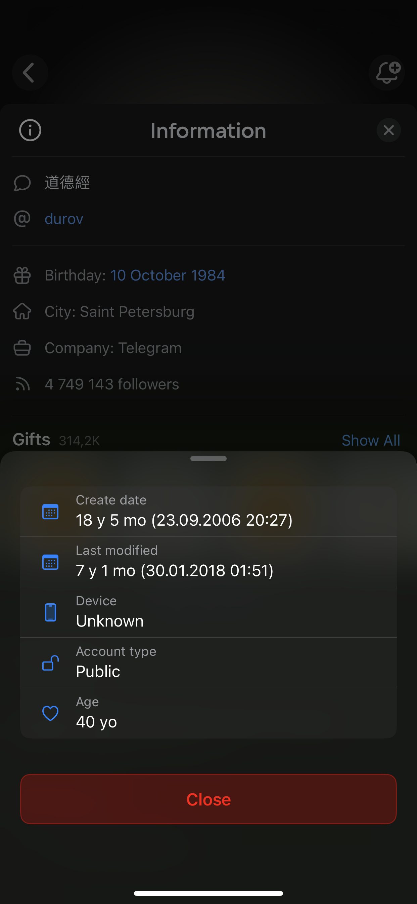

# OrwellVK
A simple yet powerful tweak for VK

## Screenshots
<table>
   <tr>
      <td></td>
      <td></td>
      <td></td>
   </tr>
</table>

  
More screenshots

  <table>
    <tr>
      <td></td>
      <td></td>
      <td></td>
    </tr>
  </table>

## Main Features
<li>Media Download: Download everything you love: videos, episodes, clips, songs, stories, and even voice messages</li>
<li>Incognito Mode: Become invisible. Browse posts, read messages, and publish entries without leaving a trace</li>
<li>Chats: Manage your chats with ease: send voice and video messages, graffiti directly from the gallery. Pretend you're typing</li>
<li>Simplicity: Intuitive and flexible settings that are easy to personalize</li>
<li>And More: OrwellVK is not just about settings. It hides even more features for your comfort and privacy</li>
 

**OrwellVK preferences can be found in the VK Settings and Side menu**
